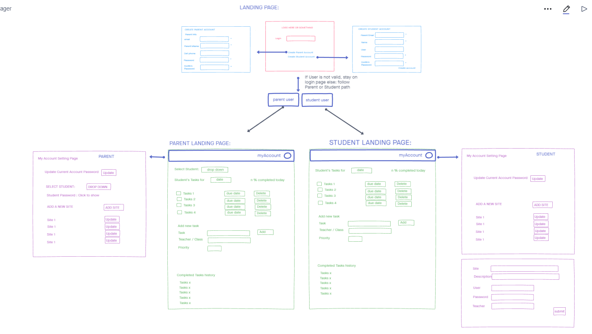

# Quarantine Student Task Manager

## Overview  
* App to help parents manage their children's homework, websites, and associated passwords.

---

## Dependencies  

---

## Authors  
- Software Developer: Joseph Zabaleta
  - [Official Github](https://github.com/joseph-zabaleta)  
- Software Developer: Jesse Pena
  - [Official Github](https://github.com/jpchato)  
- Software Developer: Iris Leal
  - [Official Github](https://github.com/ilealm)  

---

## License  
This project is under the MIT License.

---

## Acknowledgements / Resources / Inspiration Links 
- none

---

## Version History  
- 1.0.0 20200708
  - Initial files created.  
- 1.0.1 20200709  
  - Updated README.md  
  - Added Requirements.md and assets directory  
  - Added assets photos for wireframe, domain model, dataflow  

---
## Initial Wireframe  
  

---
## User Stories  

[Link to Project Management Board (Trelo)](https://trello.com/b/JWcaoKdN/python-final-project)  

- User Story 1: 
  - Homework List:  
    - As a parent with kids in elementary or middle school during quarantine, I need a way to organize my kids homework. So that they can succeed in doing homeschooling and I can work.  
  - Acceptance Tests:  
    - The kids have a way to control their task list.  
- User Story 2:  
  - Login Page:  
    - As a parent, I want to be able to log into a site where my kids can track their homework. So i can set up my kids accounts.    
- User Story 3:  
- User Story 4:  
  - Create Account:  
    - As a user I want to be able to create an account and add students under that account.  
  - Feature Tasks:  
    - Students added should have a name, user, and password.
    - Parents added should have email, name, cellphone, password.  
- User Story 5:  
  - Student User's Page:  
    - As a user I want a page where my children can store websites with the associated login credentials and the teacher for that course.  
    - Studend User should be able to add (possibly update) their student user's page.  

---

## Software Requirements  

[Link to Software Requirements](requirements.md)  

---

## Domain Modeling  
 
  