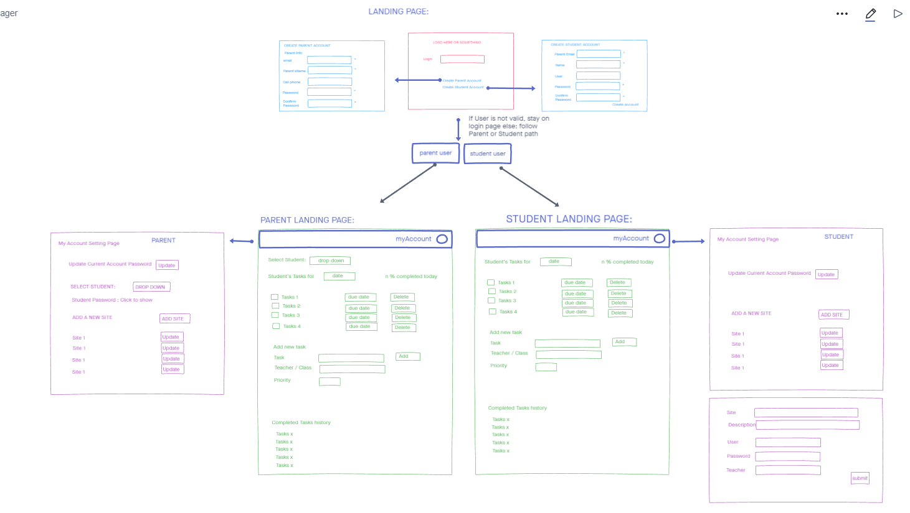

# Software Requirements
[Link to Main README](README.md)

## Vision
* What is the vision of this product?  
    - Product for parents to manage/organize student workflows.  
* What pain point does this project solve?  
    - Helps forgetful students keep track of websites and passwords for school.  
    - Allows Parents to have oversite of students tasks  
    - Allows Parents to have access to student's site information if student forgets.  
* Why should we care about your product?  
    - Prevents embarassment of parents having to reach out to schools countless times for password retrieval for there students.  

    
---

## Scope (In/Out)  
* IN - What will your product do:  
    - Provides organizational skills to elementary or middle school students through the ability of creating task lists and managing school sites/passwords.  
    - Allows Parent overview of a students tasks list and the ability to add, edit, or delete items.  
    - Allows students to modifty there own tasks and site list.  

* OUT - What will your product not do:  
    - It will not create tasks for you.  
    - This is local and will not connect to outside services or automatic tasks machines.  

---

### Minimum Viable Product vs Stretch Goals 
* What will your MVP functionality be?
    - Create list of tasks for a student
    - Create a site/password list for a student 
    - Allow a parent to see a specific student tasks/sites list  
    - Website that can allow the user to create a list of tasks, websites, and passwords for each child.  
* What are your stretch goals?  
    - Login with authentication  
    - Send alert to parent via cell phone when tasks for a student have been completed.  
    - Add the ability for a calendar view  

---

## Functional Requirements  

1. A user can create either a parent or student account.  
2. Either user type can update their account settings.  
3. Parent Account's have more access to control student accounts.  

---

### Data Flow  

---

## Non-Functional Requirements  
1. Usability
    - The overall application has few buttons and no extra material to confuse a user. It is designed a simple straight forward manner with the customer's user experience in mind.  

2. Testability
    - Utilize automatic testing, that will be able to mock user inputs and validate answers/query results from database and more.  
3. Compatability
    - There will not be any restrictions that will prevent the use of the application on the majority operating system.